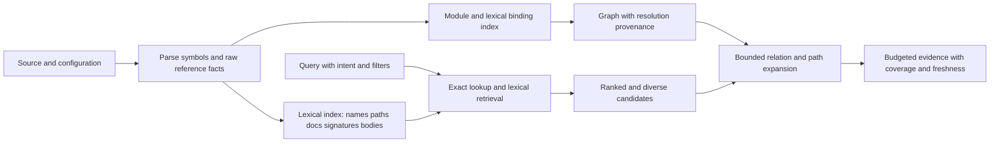

# Potential solutions and evaluation gates

> Historical investigation / correctness-only revision. The subsequent implementation and current verification are in [07-lexical-and-incremental.md](07-lexical-and-incremental.md).

## Recommendation

Keep graph traversal, but make lexical retrieval the candidate generator and make binding evidence explicit. Repairing extraction and graph contracts is necessary; it does not solve the observed ranking problem. The controlled FTS experiment supplies stronger evidence for identifier-aware lexical retrieval than for embeddings or replacing the graph database.

## Stage 1 — Establish a trustworthy baseline

The current branch supplies the correctness repairs and regression fixtures. Review these as a distinct change from a ranking redesign. Keep the exact-name, filter, ambiguity, incoming-edge, source-ownership, and byte-budget regressions permanently.

Before integrating with nanus, add a release-mode benchmark that separates: opening the store, checking freshness, parsing, binding, store apply, lexical lookup, graph expansion, snippet reads, and serialization. Re-run the repository's original agent evaluation plan after the retrieval changes, not before.

Acceptance:

- Every correctness regression passes on both memory and persistent adapters where applicable.
- No ambiguous target silently chooses a definition.
- A non-empty sync followed by the same queries agrees with a clean reindex, ignoring timings and equivalent stable ordering.
- Named target/source checks never get worse while aggregate resolution rate improves.
- Cold and resident costs are reported separately. Index and source hashes accompany every accuracy result.

## Stage 2 — Add an identifier-aware lexical index

### Candidate design

Store one document per symbol plus documents for otherwise uncovered text/file regions. Index separate fields for:

- original and normalized bare/qualified names;
- identifier subtokens (`verifyWebhookSignature` → `verify`, `webhook`, `signature`);
- repository-relative path tokens;
- signature and nearby documentation;
- a bounded body region;
- kind, language, test/generated status, and package/module identity as filters.

Preserve original full identifiers alongside subtokens. The prototype misses one exact target because pure subtoken BM25 does not guarantee an exact match wins. An exact-ID/full-name lane must remain deterministic and take priority.

Use a broad candidate budget (for example 50–200), apply filters before ranking/capping, then choose the final small context set. Support exact lookup, AND-like coverage preferences, OR fallback, and prefix matching as separate policies. Run tokenization-only and ranking-only ablations to distinguish their contributions; this investigation measures their combined effect. Do not expose raw FTS query syntax to unescaped user strings.

A practical first implementation is SQLite FTS5 with weighted columns and BM25. SQLite documents configurable tokenizers, column filters, prefix/boolean queries, and BM25 column weights; custom preprocessing is still needed for identifier boundaries. See the [official FTS5 documentation](https://www.sqlite.org/fts5.html). The experiment uses this approach because it is easy to isolate and measure, not because the current graph must be replaced.

### Ranking and diversity

Combine exact-name confidence, lexical score, term coverage, path relevance, and optional graph proximity. Avoid allowing an arbitrary high-degree symbol to outrank a precise lexical match. Treat production source, tests, documentation, and generated artifacts according to query intent; never globally suppress tests when the question asks about tests.

Select context with a per-file cap or a diversity penalty. The baseline often spends all eight slots on sibling tests/locals from one file. Evaluate both symbol ranking and file coverage, because deduplicating by file can improve task coverage while hiding a particular symbol.

Use scores for ordering, not unsupported numeric confidence. Expose match reasons such as exact name, identifier tokens, body match, or graph bridge.

### Acceptance gate

- Preserve 90/90 expanded exact-name hits.
- Reach at least 85/90 expanded split-name hits, then verify on a new untouched sample.
- Improve the task-language set without claiming the identifier-derived set is semantic accuracy.
- No filter leaks, no silent scan coverage loss, and a declared final context budget.
- Evaluate at multiple k values and byte budgets; inspect misses rather than optimizing a single number.

The 85/90 target is a proposed engineering gate, not a statistical guarantee. The current prototype's 89/90 is evidence of feasibility on this sample, not proof of generalization.

## Stage 3 — Persist raw facts and bind with module/scope evidence

The current full reprojection on a changed sync is safe but potentially expensive. Preserve extraction independently from resolution:

1. Persist symbol facts, lexical scopes, imports/exports, reference spelling, receiver form, and source occurrences by file content hash and parser version.
2. Maintain reverse dependencies for file imports, exports, name candidate sets, and resolution decisions.
3. Reparse changed files only; invalidate binding decisions affected by removed/added definitions, imports, visibility, or ambiguity.
4. Re-resolve affected references, including previously dangling references and unchanged incoming callers.
5. Apply symbol/fact/edge/lexical changes with one generation identity, then publish a coherent manifest.

A global-unique-name fallback means adding a symbol anywhere can invalidate a decision elsewhere. A reverse name-candidate dependency is therefore necessary; simply walking resolved import edges is insufficient.

### Rust priorities, driven by nanus

- Discover Cargo workspace/package roots and the `lib.rs`/`main.rs` module trees; do not assume all `crate::` paths start at repository `src/`.
- Bind `use`, grouped imports, `as` aliases, `self`/`super`, and re-exports.
- Model lexical locals and parameters before global name fallback.
- Resolve receiver types where evidence is available; distinguish inherent methods, trait methods, and dynamic dispatch candidate sets.
- Treat macros and cfg-dependent/generated code as declared coverage gaps unless compiler information is available.

For stronger semantic results, consider an optional rust-analyzer/compiler-backed adapter or SCIP ingestion rather than recreating a compiler through text heuristics. rust-analyzer's [architecture documentation](https://rust-analyzer.github.io/book/contributing/architecture.html) describes the separation of syntax and semantic analysis. [SCIP](https://github.com/scip-code/scip) provides an interchange format for code intelligence. Neither adapter was implemented or benchmarked here.

### TypeScript/JavaScript priorities

- Use tsconfig project resolution, package exports, runtime-to-source extension mapping, aliases, defaults, namespaces, and barrel exports.
- Keep lexical declarations, destructured bindings, and closure scopes distinct from member names.
- Consider the TypeScript compiler API for TS-aware bindings, with tree-sitter as the fast syntax/fallback tier.
- Add framework extractors for Svelte/Astro/Vue script regions and registrations, preserving original file coordinates.

Acceptance:

- Gold fixtures cover imports, aliases, shadowing, duplicate methods, multiple crates/packages, callbacks, and unresolved external targets.
- Report precision and recall against a manually/compiler-labelled **edge** set, not resolved percentage.
- Every resolved edge records its rule and provenance. Heuristic links are distinguishable from explicit bindings.
- Incremental results equal a full rebuild after additions, removals, renames, import edits, and ambiguity creation/removal.

## Stage 4 — Make graph queries evidence-aware and work-bounded

Add a `QueryBudget` with maximum visited nodes, inspected edges, expansions, source bytes, output bytes, elapsed time/cancellation, and result count. Enforce it inside traversal/store operations, not only when assembling the final response. Return reasons and observed counts for every exhausted budget.

Add resolution status beyond a boolean:

- explicit lexical/import binding;
- unique-name heuristic;
- candidate set or dynamic dispatch;
- unresolved external/local/unsupported;
- parser or policy coverage gap.

Keep reference **occurrences** separate from the deduplicated relationship graph. Callers often wants distinct source symbols; refs often wants every occurrence with its own path/line. A single edge identity cannot satisfy both perfectly.

Maintain efficient outgoing/incoming indexes for dangling as well as resolved references. Inspect the per-query cost of rebuilding name tables and re-reading full node sets before optimizing the storage engine itself.

Acceptance: adversarial high-fanout/cyclic graphs return within explicit budgets, preserving valid prefixes and reporting truncation. Counts are labelled as returned/observed/total only when their semantics warrant it.

## Stage 5 — Assemble context around intent

A symbol lookup, caller question, impact question, and vague task question need different context:

- exact identifier → definition, signature, a useful bounded source excerpt;
- caller question → source-confirmed callsites and caller signatures;
- path question → ordered intermediate nodes and edges;
- impact question → ring summary plus affected production and test nodes;
- task question → diverse lexical seeds, limited graph connections, relevant docs/config evidence.

Budget complete small symbols or meaningful blocks where possible. Avoid cutting every result at two lines of a declaration. Include match lines for body hits and be explicit about omitted bodies. Measure “can the user/agent act from this output?” with downstream tasks, not only hit rate.

A reranker or embedding fallback is a later option for synonym-heavy questions. Evaluate it against the task-language failures after lexical retrieval, binding, and context selection are sound. Costs include model distribution, latency, freshness, storage, and offline behavior. No experiment here establishes that embeddings are necessary or sufficient.

## Storage alternatives

| Option | Advantages | Costs / unresolved questions |
|---|---|---|
| Grafeo graph + SQLite FTS sidecar | Smallest controlled experiment; retain existing graph port | Two persistence domains need generation consistency and recovery |
| SQLite nodes/edges + FTS5 | One transaction domain; inspectable tables; straightforward occurrence index | Graph traversal/index design and performance must be benchmarked; migration effort |
| Grafeo plus a Rust inverted-index library | Potentially efficient lexical retrieval without a second SQL engine | More custom relevance, incremental, and recovery integration |
| Compiler/SCIP semantic graph + lexical index | Stronger language-specific bindings and references | Toolchain configuration, partial projects, build costs, heterogeneous language support |

**Do not choose a backend from these retrieval numbers alone.** The main measured gains come from tokenization/ranking and extraction correctness. Compare storage candidates under identical extracted facts, query semantics, freshness guarantees, and output budgets. The research harness provides the boundary at which to run that experiment.

## Next evaluation design

Freeze a new held-out set with at least 20 tasks per repository spanning exact names, prose questions, callers/callees, callbacks, imports, ambiguity, paths, impact, unsupported languages, no-answer queries, and changed-file states. Label symbols, file regions, and relevant edges independently of either engine's output. Review disagreements manually.

Run the baseline, this corrected engine, corrected engine + lexical index, and CodeGraph under explicit source and context budgets. Add the original nanus in-process agent task evaluation with fixed model settings and randomized arm order. Measure task correctness, search calls, inspected source, model tokens, elapsed time, false assertions, and stale answers. That is the evidence needed to answer the repository's original integration question.
