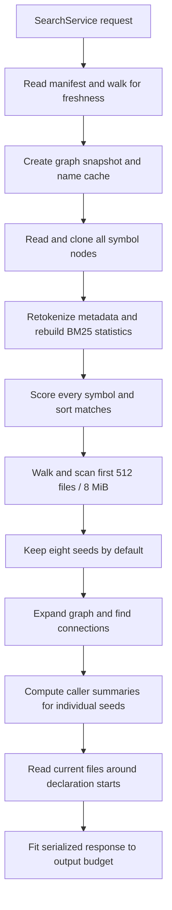
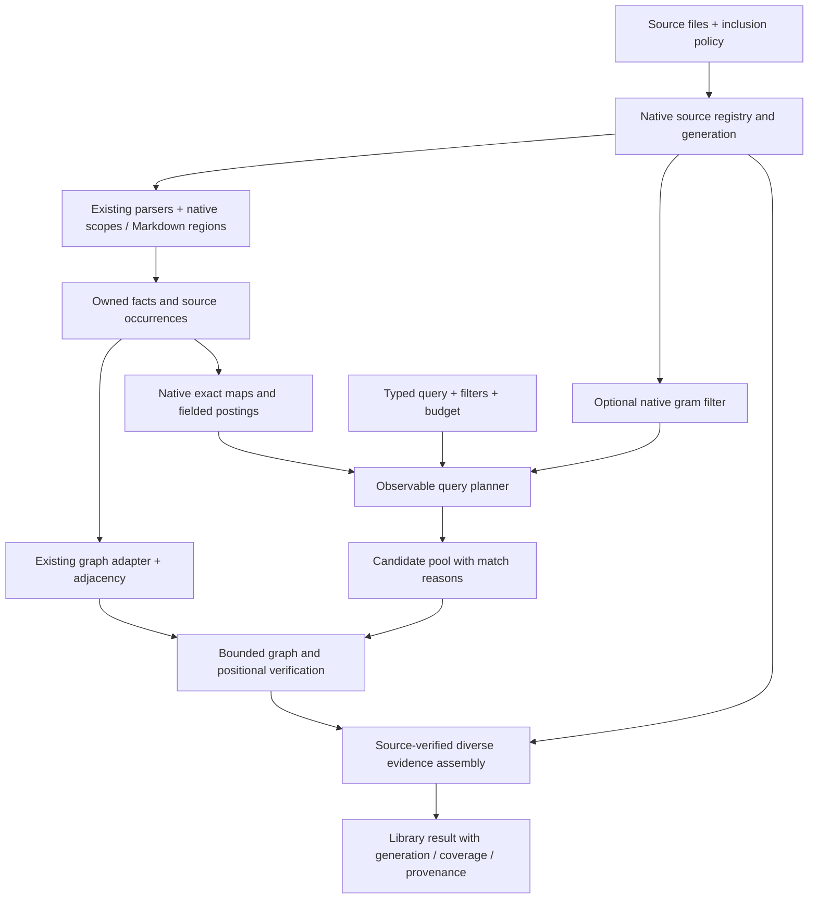

# Native search improvements: research, implementation review, and experiments

Evidence date: **19 September 2026**. Production revision: **`bdcbecef41d9863bca23830ed30615f1c219064d`**.

## Decision

Keep graph-search's in-process Rust architecture and its existing graph and parser adapters. Build a native retrieval layer around them. The highest-value work is **correct evidence and bounded execution → reusable lexical postings → searchable bodies and documentation → better context assembly → scope-aware graph resolution**. Embeddings, learned sparse models, and sophisticated pruning should follow demonstrated need.

This review adds native experimental code, a reproduction script, and evidence artifacts. It does **not** change production search behavior or add dependencies. Recommendations below describe native implementations; references to SQLite FTS5, Tantivy, Lucene, Zoekt, Blackbird, stack graphs, and research systems identify lessons, not components to install.

The most consequential experimental results are:

- A 480 KB dense-match text file takes **1,196 ms** to return one hit. A native line-oriented prototype with the same walk/read takes **0.153 ms** on that fixture. The current matcher repeatedly counts all preceding newlines before enforcing the result cap.
- On 50,000 synthetic symbols, rebuilding metadata statistics and scoring takes **137–142 ms**. Reusing the same scorer takes **2.33–7.70 ms**. A simple native inverted representation takes **0.0011 ms** for 50 matching documents and **2.66 ms** for a query matching all 50,000. Full positive score maps agree on the checked fixtures. These are isolated, warm, synthetic measurements, not production latency forecasts.
- Across the source-valid external tasks, production graph-search finds every required file for **19/34 tasks**, but delivers all required code regions for **6/34** under the existing four-call evidence protocol.
- In a separate candidate-only ablation, native body windows reach **30/34** all-required-file hits in the first eight distinct files, metadata reaches **21/34**, and simple fusion reaches **27/34**. This establishes a promising candidate representation, not downstream answer success or equivalent context-budget performance.
- Fault probes reproduce lost atomicity on a failed write, mismatched source snippets, local-shadowing false edges, late-filter scan misses, and an unbounded graph edge payload despite a one-node limit.

## Scope and evidence discipline

I inspected the public library, query engine, lexical scoring, text/file walking, freshness and incremental projection, memory and Grafeo adapters, identity/result contracts, language extraction/resolution, CLI wrapping, and evaluation harness. The existing accuracy research matters: identifier tokenization, native BM25, and selective parsing are **already implemented**. Earlier documents proposing these as new work are historical.

The research reading centered on the corrected [comprehensive synthesis](/Users/stan/research/search/COMPREHENSIVE_SUMMARY.md), the [implementation comparison](/Users/stan/research/search/deep-dives/COMPARISON.md), its [reconciliation](/Users/stan/research/search/deep-dives/RECONCILIATION.md), and relevant report/source passages. This is a deep application of that research, not a claim to have independently replicated every paper or audited every archived upstream file. In particular, the archive's Tantivy pruning failure remains the archive's pinned experiment; the native probe here demonstrates the underlying bound problem algebraically.

Three evidence classes are kept separate:

1. **Observed:** current source behavior or a reproduced fixture.
2. **Measured:** this review's execution, with a stated corpus and boundary.
3. **Proposed:** an implementation or expected benefit requiring evaluation.

No external application's tests, deployment, credentials, or production services were used. External source snapshots remained unchanged. Existing CodeGraph indexes were queried and audited, not rebuilt. The checkout initially had no CodeGraph index; one appeared during the session, and subsequent exploration used it.

## Current architecture and where work accumulates



This describes `explore`, not every search mode. `files` walks the live tree; `text` scans live bytes; graph modes read the projected graph after a freshness check. That distinction is sensible. The problem is unnecessary repeated work and inconsistent evidence boundaries inside the combined mode.

Important source anchors:

| Area | Current implementation | Consequence |
|---|---|---|
| Library freshness | [service.rs](../crates/graph-search/src/service.rs), `freshness`, `graph`, `explore` | Deserializes the manifest and walks on graph requests; returned freshness is discarded by the library result path |
| Snapshot creation | [store.rs](../crates/engine/src/store.rs), `GrafeoSnapshot::new` | Rebuilds a bare-name map from all node properties on each snapshot |
| Lexical retrieval | [lexical.rs](../crates/core/src/lexical.rs), `LexicalIndex::new`, `score` | Per-query token maps/statistics and exhaustive document scoring |
| Seed selection | [query.rs](../crates/core/src/query.rs), `seed` | Longest query token drives body fallback; all positive metadata scores outrank body hits |
| Filtering | `seed`, `passes_filters` | Body filters run after scan work; globs compile repeatedly per node |
| Context | `snippet_for`, `connect`, `explore_with_policy` | Declaration-centered excerpts, repeated source reads and graph work, late byte fitting |
| Literal search | [text_search.rs](../crates/core/src/text_search.rs), `search_text` | Whole-file match discovery plus repeated prefix/line rescans |
| Incremental writes | [reconcile.rs](../crates/core/src/reconcile.rs), `extend_dependents` | Selective parsing, but bulk graph/fact reads and potentially broad replacement closure |
| Persistence | [store.rs](../crates/engine/src/store.rs), `apply`; [sidecar.rs](../crates/engine/src/sidecar.rs) | Graph mutations precede fallible sidecar persistence; independent manifest publication |
| Semantics | [resolve.rs](../crates/core/src/resolve.rs), `resolve_reference` | Conservative receiver handling, but bare-name fallback without a complete lexical binding model |

Preserve the existing inward dependency direction. The domain should own query/scoring/budget semantics; adapters should provide efficient access without leaking Grafeo or parser types.

## Experiments

### A. Current correctness and synthetic execution

[Native results](results/native-review-2026-09-19/native-probe.json) and [probe source](harness/src/bin/native_probe.rs) contain the complete fixtures.

| Probe | Observed result | Interpretation |
|---|---|---|
| Failed sidecar write during `apply` | Returns an error, but the old symbol is gone and the new symbol exists | Violates the port's promise that a failed batch is abandoned whole |
| `Reconcile::Never`, edited source | Result describes `original`; snippet contains `replacement_function`; no stale field in `ExploreResult` | The library can combine old graph facts with new source without an attached freshness indication |
| Same-length edit, restored mtime | Default policy reports zero changed files and returns the old symbol | Metadata freshness is a heuristic, not verified content identity |
| 512 unrelated files before explicitly filtered target | Zero items; renaming target to sort first yields one | Filtering cannot rescue files already excluded by a global scan prefix |
| Query `cache invalidation`, body contains `cache` only | Zero items; `cache` alone returns the file | Body candidate generation uses only the longest token, not a multi-term retrieval policy |
| Eight metadata matches plus a relevant Markdown body | All eight slots go to metadata from one file | Body evidence can never compete with any positive metadata score |
| One-hop star, result limit one | 1 node, 2,000 edges, **282,252 serialized bytes** | Node limits neither bound traversal work nor ordinary graph payloads |
| `let send = other; send();` with a global `send` | Resolved call points to global `send` | Missing value-shadow tracking creates a false edge |
| TypeScript function at byte zero | Span begins at byte one | Shared JS/TS span helper applies a line-number conversion to byte offsets |
| Literal containing a newline | Case-sensitive path returns a hit; ignore-case path returns none | Two execution paths implement different multiline semantics |

The graph fixture has two valid file projections and a 2,000-leaf call star. The persistence fault is a controlled filesystem error in a temporary in-memory Grafeo store with sidecars, **not a power-loss or crash-recovery test**. The metadata-freshness probe deliberately restores mtime; it establishes a possible miss, not its prevalence in ordinary editing.

Dense text timing, one matching result requested:

| Lines | Bytes | Current, ms | Native line-oriented prototype, ms |
|---:|---:|---:|---:|
| 4,000 | 60,000 | 19.59 | 0.134 |
| 8,000 | 120,000 | 74.10 | 0.134 |
| 16,000 | 240,000 | 298.36 | 0.141 |
| 32,000 | 480,000 | 1,195.68 | 0.153 |

The prototype preserves the walk/read costs for this single-file, ASCII fixture and stops after observing the extra match needed to report truncation. It is not a complete replacement scanner: Unicode, binary detection, errors, multiline policy, and all output semantics still need implementation and regression coverage. The roughly fourfold cost per input doubling is consistent with the actual repeated-prefix loop.

Lexical execution at 50,000 symbols:

| Query distribution | Matching documents | Rebuild + exhaustive score, ms | Cached exhaustive score, ms | Cached native postings, ms |
|---|---:|---:|---:|---:|
| Selective | 50 | 137.12 | 2.328 | 0.0011 |
| Broad | 50,000 | 142.08 | 7.701 | 2.661 |

The prototypes retain the current tokenization, stopwords, weighted frequencies, IDF floor, lengths, and accumulation order. They assert equality of complete positive score maps for selective, broad, multi-term, and missing queries at 1k/10k/50k documents. They do not measure persistent-index construction, update maintenance, parsing, source fetch, serialization, or graph expansion. Sub-microsecond/small-microsecond values should be interpreted as “very little work on this fixture,” not an SLA.

On a clean Git archive of graph-search itself, the public resident library indexes 193 files, 1,524 nodes, and 7,281 edges. Its manifest is **2.65 MB**. Indexing took about **260 ms**, exact symbol queries about **10.3 ms**, and three representative `explore` queries about **22.7–23.0 ms**. Even `explore("LexicalIndex")` scanned all 193 files. This is a small-corpus sanity measurement, not a load test. [Results](results/native-review-2026-09-19/repository-probe.json).

### B. External repository evidence trials

The existing 60-task suite was validated before retrieval. **34 tasks remained byte-for-byte source-valid:** 16 nanus, 4 blogwright, and 14 whatsurvey. The other 26 were excluded solely for source drift or missing files; prompts and labels were not rewritten to fit outcomes. See [label validation](results/native-review-2026-09-19/label-validation.json).

All three arms ran three repeats: **306 completed trials, no tool-error trials**. Retrieval evidence was identical across repeats. Each trial had four calls, 16 KiB per response, and 48 KiB cumulative response content. No model answered tasks; every task-success value remains null.

Counts below are **distinct tasks**, not repeats:

| Repository | Tasks | graph-search: all files / all regions | CodeGraph: all files / all regions | Fixed text baseline: all files / all regions |
|---|---:|---:|---:|---:|
| nanus | 16 | 9 / 0 | 7 / 1 | 1 / 0 |
| blogwright | 4 | 3 / 2 | 4 / 4 | 0 / 0 |
| whatsurvey | 14 | 7 / 4 | 3 / 0 | 0 / 0 |
| Total | 34 | **19 / 6** | **14 / 5** | **1 / 0** |

Median trial times for graph-search were 89, 33, and 269 ms respectively; CodeGraph medians were 356, 259, and 572 ms. These are different integration paths: graph-search is a release-mode resident library, while CodeGraph and ripgrep incur subprocess startup. Initial graph-search indexing is excluded from trial time and recorded separately. Do not infer that the underlying graph-search algorithms are universally faster.

CodeGraph's indexed-file hashes matched current contents before and after the run: 125 indexed files in nanus, 126 in blogwright, 2,134 in whatsurvey. This verifies freshness of those indexed records, **not equality of each tool's inclusion universe**. For example, exploratory CodeGraph output included a hidden whatsurvey worktree; graph-search's default walk excludes hidden content. All external worktrees were already dirty, and their tracked/nonignored source snapshot hashes remained unchanged.

The text baseline is a deliberately broad, fixed OR query with path-ordered output, not an adaptive developer using grep. Its poor result is evidence against that query policy, not against text search. The surviving four blogwright tasks cover only two families and cannot represent the repository broadly. Debug/change variants and repeated runs are correlated. Current results cannot be compared directly with the historical 60-task totals as a regression score.

[Per-trial results](results/native-review-2026-09-19/external-results.json), [summary](results/native-review-2026-09-19/external-summary.json), and [manifest](results/native-review-2026-09-19/external-manifest.json) retain denominators, source identities, freshness checks, build identity, budgets, and setup costs.

### C. Native body candidate ablation

Configuration was fixed before execution: current weighted BM25; 80-line, nonoverlapping body windows; at most 200 ranked occurrences per channel; best occurrence rank per file; RRF constant 60; no model, stemming, parameter search, or new dependency. Metadata uses all non-file graph nodes. Windows cover readable, nonbinary files admitted by the same walk policy, including unsupported languages and Markdown. This is an intentionally simple baseline, not the proposed final section parser.

| Repository | Metadata files @8 | Body files @8 | Fused files @8 | Fused files @50 |
|---|---:|---:|---:|---:|
| nanus, 16 tasks | 11 | 14 | 15 | 16 |
| blogwright, 4 tasks | 3 | 2 | 2 | 4 |
| whatsurvey, 14 tasks | 7 | 14 | 10 | 14 |
| Total, 34 tasks | **21** | **30** | **27** | **34** |

Metadata alone reached 31/34 at 50 files; bodies reached 33/34. The fused pool contains the required files for all 34 tasks at 50 files, but its top-eight ordering loses three tasks relative to body-only. That is a concrete candidate-generation versus ranking distinction.

These are **file-candidate** results. Eight files may contain far more source than the production evidence budget, and candidate IDs do not count as delivered source. Metadata's file deduplication already differs from production's eight symbol seeds, explaining why 21/34 here must not be substituted for production's 19/34. No full-region, citation, or answer-success claim follows from this experiment. Preserve the useful loss cases: blanket RRF is not an established improvement, and blogwright supplies a counterexample to adopting body-only globally.

[Candidate summary](results/native-review-2026-09-19/candidate-summary.json), [nanus](results/native-review-2026-09-19/nanus-candidates.json), [blogwright](results/native-review-2026-09-19/blogwright-candidates.json), [whatsurvey](results/native-review-2026-09-19/whatsurvey-candidates.json). External source hashes also remained unchanged across this experiment.

## Recommendations, in implementation order

### 1. Make failed writes leave a coherent generation — P0

`GraphStore::apply` promises atomicity, but the adapter deletes/inserts graph records before writing dangling references. The injected sidecar failure demonstrably leaves the graph modified. “Commit the manifest last” supports some replay paths; it does not make the graph/sidecar/manifest update atomic.

Implement a native publication protocol. Assign each batch a generation, persist a replayable batch/prepared record, prepare all derived state, and publish a small committed-generation pointer only after the pieces are consistent. Where the existing graph adapter cannot provide rollback, either retain the prior generation or mark the projection unavailable until replay repairs it. Prevent queries from treating a failed apply as a valid snapshot. Distinguish a recoverable materialized index from authoritative source.

For durable acknowledgement, define file flush and parent-directory persistence explicitly; rename atomicity alone is not power-loss durability. Test failures after deletion, insertion, dangling preparation, graph persistence, and manifest publication, followed by reopen and clean-rebuild comparison. Also test retries after source changes again or reverts. This imports the transaction/publication lesson from FTS5 and segment systems without replacing storage.

### 2. Return freshness and source identity from the library — P0

The README says the library is the product, yet stale metadata is mostly attached by the CLI wrapper. Add a common library result context containing generation, freshness mode, changed-path count, coverage, and source fingerprints. Have the query operate on the exact context it returns. A separate later `status()` call cannot retroactively certify a response.

Support explicit postures such as verified-current, metadata-checked, and intentionally-stale. The current `(size, mtime)` shortcut should be described as metadata-checked; strict verification must hash relevant content or use immutable bytes. Cache fast checks by an explicit host mutation epoch only when the host can guarantee all modifications pass through it. Preserve no-daemon operation.

Do not simply suppress stale warnings after `sync`: changes can occur during or after reconciliation. Recheck served spans against the selected source generation, or return a visible mismatch. For strong whole-workspace consistency, serve immutable blobs; for a live-tree mode, document and detect its weaker per-file boundary.

### 3. Bind snippets to indexed bytes and fix coordinates — P0

Before returning source for an indexed symbol, verify that its file hash matches the graph generation. On mismatch, reconcile/reselect, return the indexed source if retained, or withhold the excerpt with an explicit reason. Never pair an old declaration signature with unrelated new code as if they were one piece of evidence.

Standardize zero-based, half-open UTF-8 byte ranges and one-based display lines. The TypeScript probe establishes a byte-offset bug in the shared JS/TS helper. Audit every extractor and sublanguage transform, including CRLF and multibyte characters. Add source-slice assertions: the recorded byte span must reconstruct the intended declaration. Preserve raw-to-derived mappings for later split identifiers, heading prefixes, and framework script regions.

### 4. Replace quadratic literal-hit bookkeeping — P0

Use one forward pass over source lines or a single advancing byte/line cursor. Compile the literal finder once per request. Keep a running line number rather than recounting from byte zero for every match. Stop after the first omitted matching line needed to establish truncation, not after enumerating every occurrence in the file. Avoid `lines().nth(n)` per hit.

For ignore-case matching, remove the unused whole-file lowercase allocation and specify whether the contract is Unicode lowercase, full case folding, or ASCII-insensitive. Preserve the declared choice consistently. Reject newline-containing patterns under a line-search contract, or implement a separately specified multiline matcher. Test dense matches, long nonmatching prefixes, repeated matches on one line, CRLF, Unicode expansion, empty/final lines, and result limits. This is a targeted production fix with unusually strong evidence of benefit.

### 5. Enforce work budgets and graph payload limits inside execution — P0

Introduce a request-local budget for walked entries, source bytes, postings visited, scored candidates, graph nodes, graph edges, source materialization, elapsed time/cancellation, and output bytes. Enforce budgets where work occurs. `expand(..., hops)` currently has no way to stop an enormous first ring. An output cap checked afterward cannot prevent the work or memory allocation.

Give store adjacency an iterator/batch API so one huge adjacency list is not materialized before the budget can be checked. Return continuation/incompleteness metadata for partial traversals. Separate exact counts from lower bounds. Apply a serialized-byte ceiling to all library results, not just `ExploreResult`; the one-node star probe produces 282 KB today. Preserve boundary edges through explicit compact references rather than emitting unlimited dangling endpoint payloads.

Compile filters once. Push body language/path filters before reads and before file/byte scan quotas. Be precise about graph filtering: an output scope is different from a traversal scope, and restricting traversal may remove valid paths through out-of-scope intermediate nodes. Authorization, if introduced later, needs its own contract rather than reusing a presentation filter.

### 6. Report coverage loss from the walker and extractors — P0

Change `walk` from `Vec<WalkEntry>` to a walk result containing entries plus coverage/error counters. It currently silently stops at `MAX_FILES` and skips unreadable entries. Consumers cannot distinguish exhaustion from completeness. A cap applied before sorting also makes the admitted prefix depend on traversal order.

Distinguish policy exclusions, oversized files, binary/invalid encoding, unreadable files, parser quarantine, unsupported language, explicit query budget exhaustion, and stale content. Not every ignored file needs a verbose warning, but the result must expose its searched universe. Do not infer deletion from a partial/unreadable enumeration during sync; retain or quarantine uncertain paths until absence is established.

### 7. Cache exact-name and lexical structures by generation — P1

First move the current name maps, qualified-name maps, lexical token maps, document frequencies, and average lengths out of per-query construction. Reuse them for the same committed generation. This preserves ranking while removing work measured at roughly 135 ms of the 50k-symbol synthetic query.

Build both bare and qualified lookup maps; `find_by_name` currently still scans nodes for qualified names. Keep compact document ordinals internally and stable `NodeId` values at the API boundary. Cache file-language metadata instead of fetching a file node for every language-filtered symbol. Fetch full node properties only for winning candidates where practical.

Initially rebuild the cache after a successful sync; this is simpler than incremental cache maintenance and provides a safe baseline. Then update per-file postings/statistics using the same batch as the graph. Never cache merely by query text or process lifetime. Include generation, analyzer revision, field schema, ranker configuration, and filters in appropriate cache identities.

### 8. Add a native inverted lexical index — P1

Use an ordered term dictionary and sorted postings containing document ordinal and per-field term frequencies. Retain per-document field lengths. Sparse queries enumerate only posting unions; conjunctions intersect the shortest lists first, with galloping/seek where useful. Choose sparse lists versus dense bitsets by measured density; a `Vec<u64>` bitset can be implemented natively.

Start uncompressed, without score pruning. Keep the current exhaustive scorer as a differential oracle. A deterministic bounded heap gives `O(C log k)` selection for C candidates, followed by sorting k results. A 2k buffer with periodic partitioning is another native alternative worth measuring. Neither avoids scoring C candidates, and neither should be labelled WAND.

Recommended port shape: `LexicalSnapshot::candidates(plan, budget)`, yielding compact hits, field matches, source-unit IDs, and completion metadata. The domain owns the score; persistence owns encoding. Persisted lexical data should share publication identity with graph and source records. The measured postings prototype is evidence of feasibility, not a production codec or lifecycle implementation.

### 9. Make bodies, comments, configuration, and Markdown first-class candidates — P1

Replace the longest-token, path-prefix body fallback with a real indexed body channel. The external ablation gives this recommendation stronger support than further metadata-only formula tuning.

Use multiple retrieval units: declarations and bodies for supported code, bounded fallback regions for unsupported languages/configuration, and sections for Markdown. Index doc comments separately from code bodies. Associate units with enclosing symbol, package, file, language, and source span. Support strings/errors and configuration keys without requiring a parser to produce a symbol.

Do not store every ancestor's full body: a file, class, method, and nested block would duplicate the same tokens repeatedly. Prefer primary source intervals plus references to parents. Make missing-parser fallback explicit. Evaluate code structure against the tested 80-line baseline at the same candidate and final byte budgets; structure is a hypothesis about better evidence, not an automatic ranking improvement.

### 10. Add a small, native query planner and protect explicit intent — P1

Parse a typed query plan with separate forms for exact IDs/names, path/glob navigation, literal text, ranked terms, analyzed phrase, and graph relationships. Keep the original query intact and expose which routes ran. Do not send every query through every stage.

An explicit `symbol` request should use direct maps and bounded relationships. For inferred exact intent in `explore`, a fast path must be configurable and evaluated: returning an exact seed does not always justify dropping useful discovery candidates. Literal errors and punctuation-sensitive strings need raw matching; conceptual questions need multi-term body/metadata candidates. Long task prompts should preserve meaningful literals while suppressing procedural boilerplate through a documented query policy.

Support AND/OR and optional minimum coverage explicitly, with a conservative OR fallback for natural-language discovery. Select “distinctive” terms using corpus rarity when a budget requires selection, not string length. Log omitted/expanded terms. Operators supplied as structured API fields are simpler and less ambiguous than a large query-language parser.

### 11. Redesign candidate selection separately from final context selection — P1

Retrieve a broader candidate set, then assemble the small final answer. Eight seeds is an output decision, not a justified retrieval depth. The candidate experiment's fused top-50 pool covers all 34 tested targets; its top eight does not.

Separate exact-navigation priority from conceptual ranking. Retain per-channel provenance and rank. Evaluate body-only, metadata-only, rank fusion, and normalized score/feature combinations by query class. The measured RRF losses rule out adopting a single formula unconditionally. Scores are ordering signals, not calibrated correctness probabilities.

Deduplicate by source occurrence, then use intent-dependent file diversity. Grouping eight sibling fields into one file can free space for another implementation. But a global one-hit-per-file rule would damage a question requiring several functions in the same module. Preserve the best span per subquestion or required relationship. Test diversity and body representation independently; the prototype changed retrieval units and file grouping, not just a weight.

### 12. Select source around matches and relationships — P1

`snippet_for` uses the declaration's start, not the matching location or full implementation span. Its ten-line maximum is often insufficient for the behavior a query asks about. The nanus result—nine tasks find files, zero deliver all required regions—makes source assembly a distinct priority.

Carry matched offsets from lexical retrieval. Score candidate windows for term coverage, proximity, declaration identity, and relevant call sites. Include a short signature/header plus the body region that contains the evidence. For a connecting path, return its call-site spans and the needed endpoint context. Expand to a complete small function when it fits; for large functions, return several labeled source intervals rather than pretending an excerpt is the complete body.

Pack evidence by marginal value per byte. Merge overlapping intervals from one file, avoid duplicate lines, and reserve enough metadata/edge budget to explain relationships. Read each source blob once per request. Stop materialization when the remaining budget cannot admit useful content. Evaluate complete-region coverage, supported citations, redundant bytes, and answer success independently.

### 13. Preserve whole identifiers and improve analyzer contracts — P1

The current tokenizer splits camelCase/acronyms/snake_case well, but only stores subtokens in lexical metadata. A lowercase whole identifier can be rescued by exact matching alone; inside a longer question that rescue no longer applies. Index original spelling, optional normalized whole spelling, and split terms in separate fields. Include qualified names in non-exact retrieval as an explicit field, not just exact equality.

Retain operators, paths, flags, and configuration keys in raw/exact routes. Do not stem identifiers. Stopwords are currently removed from every indexed field even when a single query retains one; exact-name priority hides only some cases. Use field- and query-specific analysis, with documented token positions for phrases.

Version normalization rules. Test combining marks, acronym/digit boundaries, Unicode identifiers, camelCase with numbers, qualification separators, and long identifiers. Full Unicode normalization requires a deliberate native table/data strategy; do not advertise full case folding or normalization based only on `to_lowercase`. Avoid silently conflating visually similar characters.

### 14. Evaluate field normalization and positive IDF, without conflating them — P1/P2

Current scoring is FTS-style weighted term frequency with **one combined document length**, not full BM25F. It uses a Robertson IDF floored to `1e-6`. For N=100 and df=80, that floor contrasts with approximately 0.227 for `ln(1 + (N-df+0.5)/(df+0.5))`. This difference is a design choice, not proof that current results are incorrect. [FTS5 formula](https://www.sqlite.org/fts5.html#the_bm25_function).

Adding long bodies to the current combined-length score could weaken name/signature evidence. Compare separate field scores with independent normalization against true BM25F: normalize field frequencies, combine weighted evidence, then saturate. Keep field populations, missing fields, overlap treatment, k1/b, boosts, and IDF explicit. Avoid duplicating headings/path text into every field without measuring its effect on statistics.

Run analyzer-only, fields-only, IDF-only, and normalization-only ablations on development families. Preserve exact navigation as a separate contract. BM25+, BM25L, pivoted normalization, and query likelihood are lower-priority alternatives; the research does not justify formula shopping before filling the demonstrated body/coverage gap.

### 15. Add native phrase and proximity verification — P2

Store token positions where phrase queries justify the cost, with separate original byte offsets for source evidence. Use postings to select candidates, then positional alignment to verify the predicate. Define ordered adjacency and unordered window semantics precisely; engine-specific “slop” numbers are not portable definitions.

For conceptual ranking, a bounded proximity feature or ordered-bigram feature can distinguish “cache invalidation” from words scattered through a file. Keep raw literal phrase matching separate from analyzed adjacency. Whole identifiers and split subwords should not create accidental multi-token paths in a phrase field. Begin with ordinary positions; add selective shingle indexes only if common-phrase profiles show enough benefit to pay the storage/update cost.

### 16. Add a sound native trigram prefilter when scan economics justify it — P2

For repeated long-literal searches, index distinct byte trigrams per file, intersect selective postings, and verify raw source. All grams being present is only a candidate condition: they may occur in unrelated places. Patterns shorter than three bytes, weak constraints, dirty files, or incompatible normalization must fall back to the corrected scanner. [Cox's filter-and-verify design](https://swtch.com/~rsc/regexp/regexp4.html).

Use byte trigrams first for a byte-exact UTF-8 literal route. Case-insensitive search needs a sound compatible representation or broader candidate logic; lowercasing query bytes against a raw-case index is not sound. Suppress superseded base hits and scan/reindex dirty paths in an overlay.

Estimate break-even from measured build/update cost and saved scan cost: repeated-query savings must exceed maintenance. Small changing trees may prefer scans. Only then consider positional grams, rare-gram pair selection, sparse variable-length grams, or a suffix-array alternative. Blackbird's scale and Zoekt's storage ratios are not requirements for this library.

### 17. Add regex only with a clearly bounded native contract — P2/conditional

Today `text` explicitly means literal substring; preserve that API. If regex is needed, add a separate mode and native restricted regular-expression compiler/executor, for example a Thompson NFA with bounded states and work, followed later by selected DFA/literal accelerations. Avoid backtracking and reject unsupported constructs explicitly. A full general-purpose regex implementation is substantial work and should not delay the literal fixes.

A gram filter for regex must derive necessary constraints from syntax: alternation generally needs OR, concatenated requirements can use AND, optional branches can remove requirements, and unconstrained repetition may force a scan. Prove `true match ⇒ passes filter` with differential generated-pattern tests. Cap compilation, expansion, scan work, and output separately. Never label a budget-stopped search exhaustive.

### 18. Add prefix lookup before fuzzy matching — P2

Use the ordered dictionary for bounded prefix enumeration, optionally scoped by identifier/path field. Distinguish a token prefix from a whole-name prefix and an arbitrary substring. Short prefixes can enumerate large vocabularies; report expansion limits.

Later add edit-distance suggestions using a native trie/automaton or bounded dynamic programming over selected dictionary ranges. Start with small edit distances, minimum prefix/length constraints, and explicit suggestions. Do not silently rewrite an exact symbol or configuration key. Aggressive synonyms and spelling correction are particularly risky for code, where one character can identify a different API.

### 19. Preserve reference occurrences separately from graph adjacency — P1

`EdgeId` identifies `(from, kind, to)`, while an edge carries only one source line. Store deduplication therefore collapses multiple calls between the same symbols. That is appropriate for adjacency, but insufficient for an “every reference” occurrence contract and precise context assembly.

Introduce occurrence records keyed by source unit, byte range, kind, and raw target spelling. A resolved relationship can reference several occurrences and retain an aggregate count. Keep the compact adjacency graph for traversal. The raw extraction cache already provides a starting point; extend its spans and identities rather than reconstructing occurrences from aggregated graph edges.

This also improves incremental ownership: a file owns its emitted occurrences, while target identity is a separate binding. Removing a target should invalidate bindings without forcing unrelated source evidence to disappear.

### 20. Make resolution scope-aware before increasing its reach — P1

The local-shadowing fixture is a false positive, not merely a missing dynamic edge. Build native lexical scopes, declarations, import bindings, visibility/order rules, and reference occurrences before global-name lookup. Block scopes, parameters, destructuring, closures, local callable aliases, and nested declarations must participate.

A practical first fix records when a local value shadows a symbol and leaves the call unresolved or points to the local binding with provenance. Resolving `let send = other` transitively is a later dataflow feature. Do not replace a known false target with a speculative true target. Record resolution classes such as explicit lexical, explicit import, qualified, unique-name heuristic, candidate set, and unresolved reason. A boolean `resolved` currently treats very different evidence strengths alike.

The transferable [stack-graphs lesson](https://github.com/github/stack-graphs) is file-local scope facts and composable resolution paths. Implement that principle natively and incrementally; adopting its library or pretending to recreate full compiler semantics is unnecessary. Evaluate target precision before celebrating a higher resolved percentage.

### 21. Model packages, imports, and framework regions natively — P1/P2

For Rust, discover workspace/package roots and module trees; model `crate`, `self`, `super`, grouped imports, aliases, and reexports in their actual package scope. A globally unique name is not necessarily visible from a call site. Add bounded receiver facts for clear cases before tackling trait/dynamic dispatch, macros, or configuration-specific expansion.

For TS/JS, implement an explicitly supported subset of project resolution: relative modules, source/runtime extension mapping, named/default/namespace imports, package/workspace names, reexports, and declared path aliases. Build a dependency graph for these decisions. Treat unsupported conditional exports or runtime loaders as unresolved, not suffix matches.

For whatsurvey and similar applications, native Svelte/Vue/Astro script-region extraction can feed existing JS/TS adapters with offset translation; template references need separately declared rules. Add JSX component uses, event handlers, route registrations, and dependency-injection edges only where syntax/configuration supports the relation. Distinguish framework convention edges from language binding. A parser coverage map should make unsupported embedded regions visible.

### 22. Make graph expansion evidence-driven and avoid repeated traversal — P1/P2

Retain graph relationships as a differentiator, but use them for questions that need them. Cache or share incoming neighborhoods and caller counts within one request. Avoid expanding essentially the same cone once for connections and again for every function seed. Use explicit visited-node sets in adapters, not only seen-edge suppression.

Select relation types by intent; calls/imports/implements carry different meaning from contains or arbitrary references. Keep edge direction in path answers. Bidirectional BFS can help a single shortest-path query once adjacency access and budgets are sound. For many seeds, investigate multi-source traversal and shared predecessor structures rather than repeated searches over the same subgraph. Preserve the union of evidence required to explain returned connections.

Degree, centrality, or personalized PageRank may be reranking features, but high-degree utilities should not dominate precise evidence. Evaluate graph gain against identical lexical candidates and source budgets. The research on GraphRAG does not establish that LLM-generated entity graphs or repository-wide summaries improve this coding-agent workload.

### 23. Reduce incremental invalidation and separate facts from the hot manifest — P1/P2

Selective parsing already works. Its next bottleneck is rebuilding dependency maps and replacing whole file projections. A replacement deletes incoming edges, forcing transitive repair even when declaration identity did not change. Persist occurrence ownership and stable symbol updates so unchanged targets can retain incoming adjacency. Distinguish body-only edits, signature/export changes, and binding changes.

Maintain reverse indexes for raw name consumers, imports, selected module candidates, export sets, and unresolved references. Additions can create ambiguity or resolve a dangling name, so following only existing resolved edges is insufficient. Update these indexes in the same generation protocol. HTML/CSS's current broad rebinding can later use class/link selectors as dependency keys.

Split the small freshness header from the potentially multi-megabyte raw-fact store. The hot path needs source fingerprints, policy/version hashes, and generation identity—not every extraction fact. Store facts per file/content hash and load them for affected files. Benchmark no-op sync, one body edit, public API edit, rename, deletion, duplicate-name addition/removal, and missing-cache repair against a clean rebuild.

### 24. Version policy, representations, and publication independently — P1

Record parser, analyzer, chunker, ranker, source-inclusion policy, storage format, and result schema identities. Current parser/schema constants alone cannot describe all future lexical changes. The shared schema constant also appears in CLI envelopes; separating wire compatibility from on-disk representation avoids unnecessary coupling.

Changing language enablement, ignore policy, parser behavior, whole-identifier normalization, or chunk boundaries must invalidate the relevant projections. A score-only parameter change need not force source parsing, but it may invalidate cached scores and pruning metadata. Keep logical source/occurrence IDs separate from generation-local ordinals. Avoid parsing paths back out of display ID strings; paths containing separator characters deserve round-trip tests.

### 25. Implement Markdown structure for evidence integrity — P1/P2

Add native block parsing for a declared Markdown subset/dialect: ATX and Setext headings, fenced code with both delimiter styles, paragraphs, lists, tables, frontmatter, and links. A heading splitter that mistakes `#` inside a fence for a section boundary is not sufficient. Preserve raw spans and identify unsupported constructs. Full CommonMark conformance is a larger undertaking; use its fixtures to define exactly what the initial native parser supports.

Store heading ancestry, title, prose, code-fence language/content, table headers/row groups, and links as separate fields/relations. Retrieve a bounded child unit and expand to useful parent context. Split oversized tables/fences under explicit budgets while retaining labels and coordinates. Keep authored text distinct from deterministic heading/path prefixes.

Compare sections against the measured fixed-window baseline with identical ranking and output budgets. The archive's small Markdown studies do not prove structural chunks universally win. Structure is first a source-fidelity improvement. Versioned documentation should retain occurrences for each version; content-hash deduplication must not erase path/version distinctions.

### 26. Add safe block pruning only after postings are correct and profiled — P2

First ship and retain exhaustive native posting evaluation. If broad queries dominate, add MaxScore/WAND and then block bounds under a fixed scoring contract. For a block B, require `U(B) >= max(score(d))` over eligible documents. Skip only when the bound cannot beat the worst retained result under the complete tie rule.

The archive's key warning is a bound built from the document that maximizes a local scoring factor, then consumed under changed global statistics. The native algebra probe makes the issue concrete: `(tf=1,length=1)` beats `(tf=3,length=100)` at average length 1; the ordering reverses at average length 1,000. Storing just the first pair is unsafe after that change.

A simple conservative BM25 bound combines maximum TF and minimum length, even if they come from different documents. For fielded scoring, maintain compatible per-field extrema and derive bounds with current statistics, nonnegative boosts, conservative arithmetic, and deletion semantics. A nondominated `(tf,length)` frontier can tighten bounds later. Do not reuse bounds for arbitrary negative features or a different fusion score without a new proof.

Validate optimized/exhaustive agreement after updates, merges, extreme length skew, common terms, missing fields, ties, and score-parameter changes. Block-Max Pruning's aligned document ranges are a separate design from fixed-count posting blocks; neither Seismic-style approximate routing nor exact scoring of visited candidates establishes complete retrieval.

### 27. Compress only after measuring index composition — P2

Start with sorted vectors and explicit formats. Then measure bytes spent on terms, postings, positions, source blobs, norms, facts, adjacency, and metadata. Rare code identifiers mostly stress dictionary and tiny-list overhead; common prose terms stress long postings. A single compression codec need not serve both.

Native options include delta-varints for short lists, bitpacked blocks with tails for long lists, prefix-compressed sorted term blocks, and later Elias–Fano/PFor-style alternatives where seek/decode workloads justify them. Version and checksum every persisted format, check bounds on decode, and preserve seek/position alignment during merges.

Do not introduce unsafe SIMD intrinsics into a workspace that forbids unsafe code. Favor contiguous data and compiler vectorization first; benchmark scalar decoding and platform portability. FSTs, tries, suffix arrays, and learned dictionaries are alternatives, not a mandatory checklist. The pinned research explicitly corrects older shorthand about Lucene's dictionary and block layout; copying a name without its version/contract is the wrong lesson.

### 28. Use generations and compact deltas before building a large segment system — P2

For current local scale, one immutable native lexical snapshot plus a small changed-file overlay may be enough. Suppress superseded base occurrences by path/generation and merge matching deltas at query time. Publish graph, text, and source state together. Rebuild compact structures during explicit sync when this is cheaper than elaborate incremental formats.

If sustained churn makes rebuilds expensive, introduce immutable lexical segments, live-document masks, and bounded compaction. Budget merge I/O and peak disk space, and distinguish visibility, durability, and reclamation. Tie scores to global/live statistics according to a documented policy. Old readers retaining old generations is useful for consistency but must be accounted for in memory/disk retention.

The current lock and borrowed snapshot model also deserves a deliberate concurrency contract. Do not advertise freely shared concurrent queries until the `GraphStore` thread-safety bounds and adapter behavior support them. An `Arc`-owned immutable read snapshot can shorten writer exclusion, but it is a lifecycle change requiring tests rather than a mechanical lock substitution.

### 29. Keep neural and agentic retrieval conditional — later

The research contains real code-domain learned-sparse and reranking evidence. It does not justify adding those dependencies or models to this task. First quantify which failures remain after bodies, query routing, scope facts, and context assembly.

If an existing host later supplies representations, a native exhaustive vector/sparse-dot scorer is the first reference. Model production is still a separate component/cost; a native ANN implementation does not make the model native or free. Add HNSW/IVF or quantization only after exact scan fails the measured cost target, and distinguish representation error, candidate approximation, and quantized score error. Filtered candidate recall must be tested separately from unfiltered recall.

Learned sparse needs weighted coordinates and its own score, not repeated BM25 tokens. Late interaction needs token-vector storage and bounded MaxSim work, not merely a vector per function. Cross-encoders/listwise reranking cannot recover omitted candidates. LLM rewrites should preserve exact literals, log generated terms, and consume an explicit call/token budget. Deterministic parent headings and lexical expansion from authored aliases are lower-cost hypotheses first.

Defer generative DocID/diffusion retrieval, automatic GraphRAG summaries, document-wide embedding/context generation, and large distributed vector infrastructure. They do not address the observed first-order failures, and their update/serving costs would be disproportionate here.

### 30. Turn the evaluation suite into the release decision mechanism — P1

Refresh the 26 drifted tasks through explicit source review and versioning; do not update hashes alone. Add fresh families so the four surviving blogwright tasks are not the whole TS evaluation. The 34 tasks used here are now development evidence for these recommendations; a new set is needed for independent confirmation.

Extend coverage to exact names, literals/operators, negative queries, paths, missing definitions, import aliases, scope shadowing, repeated references, framework regions, long functions, Markdown tables/fences, multiple document versions, and multi-file behavior. Include realistic tasks that need more than one source region. Balance production code, tests, docs, and config rather than globally suppressing any class.

Separate four objectives: exact matching correctness; candidate recall/ranking; delivered evidence/citation fidelity; actual agent task success. Run adaptive agent trials only with the same model, effort, call limits, and token budgets across arms, with blind source-backed grading. Current repeats contain no model and cannot certify debugging ability.

Instrument end-to-end phase timings: open, walk/freshness, parse, bind, publish, snapshot, candidate generation, scoring, graph expansion, source fetch, serialization. Measure p50/p95/p99 and cancellation under warm/cold-ish, selective/broad, filtered, update-heavy, and concurrent loads. Report memory and index size, not just query time. Bootstrap by feature family/repository where appropriate; repeats of one task are not new independent observations.

## Proposed native design



Use a source unit with distinct logical identity, occurrence identity, source hash, language/dialect, original byte/line span, parent, and representation revision. Keep compact doc ordinals internal to a snapshot. A result hit should say why it matched—exact name, split name, body term, phrase, or graph bridge—and which version/coverage boundary applies.

The migration order matters. Add result context and write generations before persisting a second index. Add reusable caches before optimized disk formats. Add occurrence ownership before trying to eliminate broad edge-rebinding closure. Add body candidates before expensive reranking. Add matched source locations before claiming those candidates produce useful answers.

## Delivery sequence and acceptance gates

| Phase | Native changes | Required gate |
|---|---|---|
| 0: correctness | Failed-write handling, library freshness, verified snippets/offsets, linear scan, honest coverage, execution/payload budgets | New failure fixtures pass; no false current-source claim; every cap visible; old state recoverable/coherent after injected errors |
| 1: retrieval execution | Generation-cached exact maps/statistics, native postings, compiled filters, top-k collection | Exhaustive/optimized score and ordering agreement; exact navigation preserved; cache invalidation correct across sync/reopen |
| 2: useful evidence | Body/comment/config units, native Markdown subset, broad candidates, matched snippets, diversity/routing ablations | Improved complete-region coverage at identical bytes/calls; candidate gains survive a fresh query set; per-repository regressions explained |
| 3: graph precision and updates | Scopes/imports, occurrence storage, binding provenance, dependency indexes, narrower projection updates | Target precision/recall on labeled edges; incremental graph and retrieval equal clean rebuild after the full mutation matrix |
| 4: measured scale | Native grams where worthwhile, phrase positions, safe score pruning, compressed/delta storage | Exact scanner/scorer equivalence; favorable total query+maintenance cost; sustained update and tail-latency budget met |
| Later only if justified | Host-supplied semantic representations, native exact scoring then optional ANN, bounded agentic exploration | Incremental quality benefit over the strong native lexical baseline at an agreed total cost and provenance contract |

No percentage improvement or latency target is treated as established by a paper. Choose product thresholds before the next held-out run. Require zero new exact-query regressions, no unreported truncation, no unverified source-span substitution, and explicit recovery behavior before trading those properties for aggregate relevance.

## What not to adopt from the research

| Technique or tempting shortcut | Decision here |
|---|---|
| FTS5/Tantivy/Lucene integration | No new engine; implement the applicable representations and lifecycle lessons natively |
| A universal BM25 variant or field weight | Not established; control analyzer/fields/units first |
| Immediate WAND/BMW | Premature before reusable postings; unsafe bounds can silently lose exact top-k |
| Always-on RRF | Rejected as a default by the candidate loss cases; test routing and calibration |
| Always-one-function or always-fixed-window chunks | Both are baselines; neither universally satisfies source/context budgets |
| Semantic chunking and generated context everywhere | Cost and benefit are workload-dependent; native structure and matched windows first |
| Global PageRank/GraphRAG as relevance truth | Graph degree and generated relationships are not binding or answer correctness |
| A suffix/FM-index because of asymptotic appeal | Defer pending raw-search workload and update/storage measurements |
| Fuzzy matching as silent correction | Suggestions/explicit mode only |
| ANN/quantization “exact fallback” as semantic truth | Exactness must name candidate universe, representation, precision, and score |
| More resolved graph edges as success | Measure target precision and missing true relationships; false edges are especially harmful |
| File hits as successful debugging | Require delivered evidence, grounded answers, and task outcomes separately |
| Bigger caps as the main quality fix | Does not repair missing candidates, false bindings, or mismatched source; measure value per byte |

## Verification and reproduction

The current production workspace passed **95 Rust tests**. The evaluation runner passed **24 Python tests** with `PYTHONPATH=evaluation`. The native probe passed release compilation, its internal differential assertions, formatting, and strict Clippy for that binary. The first offline workspace build lacked cached locked dependencies; fetching the repository's existing dependencies enabled the tests. No dependency declaration or lockfile was changed.

Run the added experiment harness:

```sh
python3 research/scripts/native_review.py --output /tmp/a-new-review --external
```

It builds only existing workspace dependencies, runs native microbenchmarks, profiles a Git-archived repository snapshot, validates external labels before selection, runs the frozen body ablation, and executes the three-arm evidence protocol. Existing output directories are rejected. External roots default to the three sibling repositories and can be supplied through `--roots`. Raw external source transcripts stay in a temporary directory; result artifacts contain paths, hashes, metrics, and synthetic fixture snippets rather than copied external source.

Useful direct commands:

```sh
cargo test --workspace --locked
PYTHONPATH=evaluation python3 -m unittest discover -s evaluation/tests
cargo run --release --offline --locked --manifest-path research/harness/Cargo.toml --bin native_probe
cargo clippy --release --offline --locked --manifest-path research/harness/Cargo.toml --bin native_probe -- -D warnings
```

[Provenance](results/native-review-2026-09-19/provenance.json) records production and probe hashes. The tests are not a full correctness proof, the body prototype is not production-ready, and this review contains no new model trial, crash-injection campaign, index-compression benchmark, or production-scale concurrency measurement. Those remaining experiments are assigned to explicit delivery gates rather than presented as completed work.
